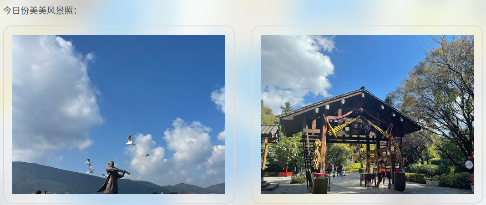
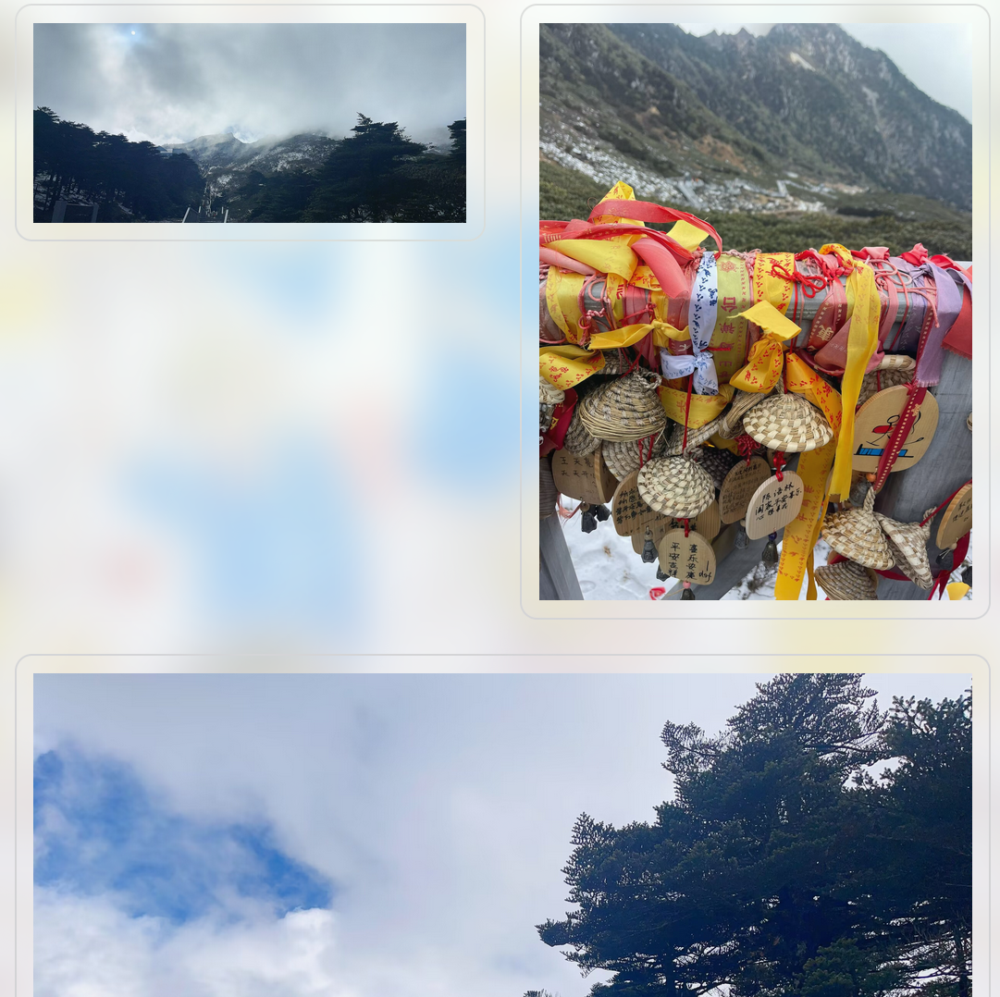

# `hexo-photo-wall` Plugin for Hexo

## Feature
Display the pictures in your blog like a photo wall.



## Installation
```bash
cd Hexo_root
mkdir plugins/
cd plugins
git clone git@github.com:Chen-Yulin/hexo-photo-wall.git
cd ../..
npm install
```
Copy `custom.styl` to the css path of your theme. By examples in the path: `themes\landscape\source\css\`.
add a line `@import './custom'` to default css, for example `style.styl`.

## Usage
Wrap your pictures with `--picture_wall--` and `--picture_wall_end--`
For example:
```
--picture_wall--


--picture_wall_end--
```
